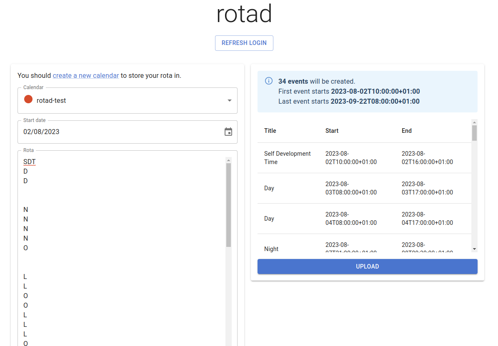
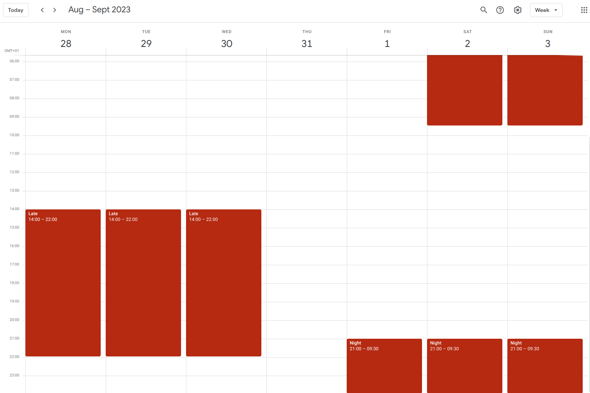

<p align="center">
  
  
  <h3 align="center">rotad</h3>

  <p align="center">
    Sync your NHS shift rota to Google Calendar.
  </p>
</p>

## Usage

**Note:** Your Google account must be whitelisted before login. Please contact me directly to get access.

Check out the hosted version [here](https://tommilligan.github.io/rotad/).

Login is provided by the Google account you wish to sync your rota to.

### Supported format

Currently supported rota format is one day per line.

This is designed to be copied from an excel column.

```
O
O
D
D
D


L
L
L
L
...
```

## Roadmap

- [ ] Custom time/parsing options for each rota code

## Gallery

Upload in action



The beautiful result


